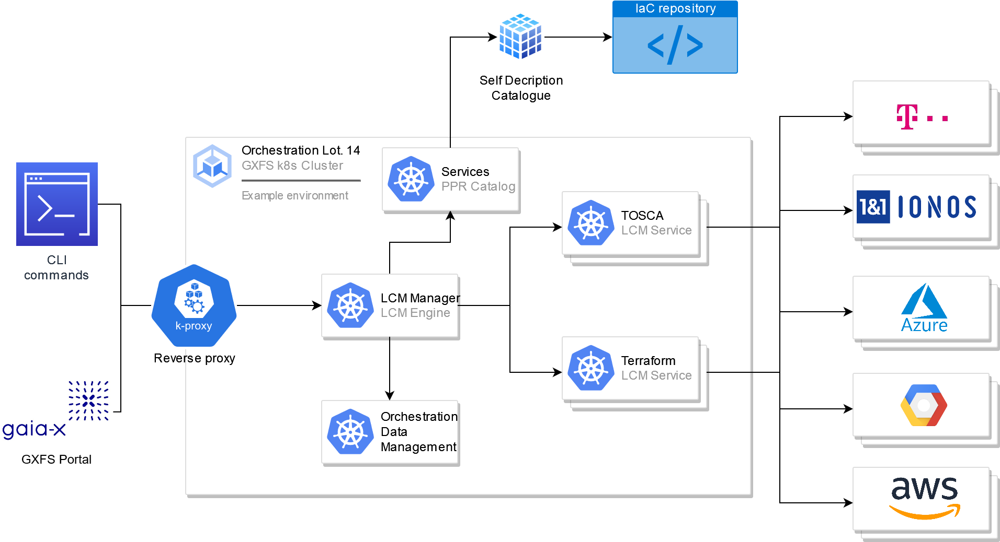

.. _Introduction:

************
Introduction
************

This documentation covers the Gaia-X Orchestration service user manual explaining the use of :term:`PPR`,
:term:`LCM Engine` and :term:`LCM Services<LCM Service>`. Together, these components are responsible for the 
instantiation and management of Services, e.g., the services can deploy, update and delete services.

.. _Architecture:

************
Architecture
************

The architecture can be presented with description of a components included in a figure attached below.

The **Orchestration tools** are: 

1. **PPR Service**: responsible for the fetching of the deployment instructions from the IaC repository, leveraged by
the Self Description Catalogues.
Any PPR who wants to provide deployment instructions to the PCR must have a service that is available in some IaC
repository, is published with an Self Description in a Self description (SD) catalogue.
The SD includes all relevant information for Portal to fetch the deployment instructions (IaC).

2. **LCM Engine**: responsible for the management of LCM Engine by the PCR using CLI, API or Gaia-X Portal, to manage
hers own service. 

3. **LCM Services**: responsible for the management of the IaC deployment controlled by the LCM
Engine.
LCM Service covers specific IaC language, as Terraform, TOSCA or others in the future.
IaC languages could be provider agnostic.

.. _User Scenario workflow:

**********************
User Scenario workflow
**********************

The intended way of using the orchestrator is the following:

1. User should find the appropriate IaC template for a Service she would like to deploy.
   The PPR Catalogue is capable of searching through published Self Descriptions and retrieve the compressed image of
   IaC archive.
   This archive could be provider specific, like TOSCA or Terraform.
2. User should prepare his account in the LCM Engine - provide the secrets to be used for each service provider.
3. User sends the IaC to the LCM Engine, and through LCM Engine initiates the preparation of the deployment environment
   (setting up the container including the chosen LCM Service, unpacking IaC into the container and setting up the
   secrets)
4. User is able to execute life-cycle management command via LCM Engine, trough individual LCM service container that
   contains and stores all deployment related states.
5. The deployment can be done on various providers that are supported thorough particular IaC language.
